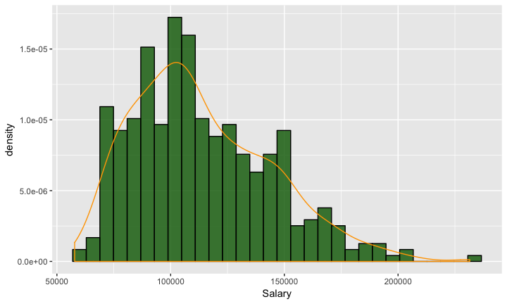
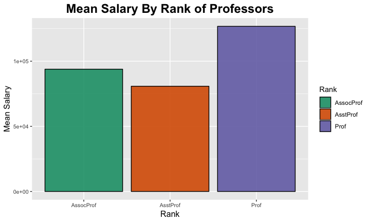
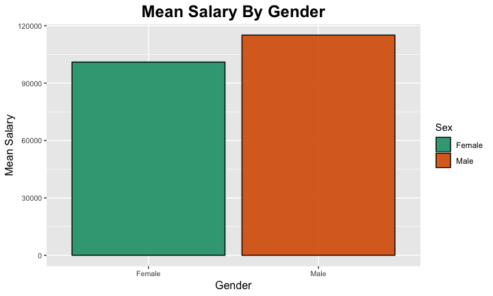
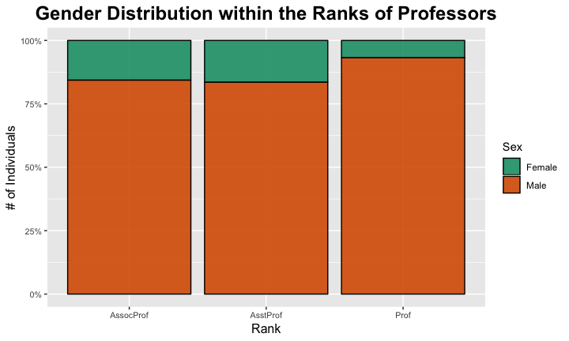
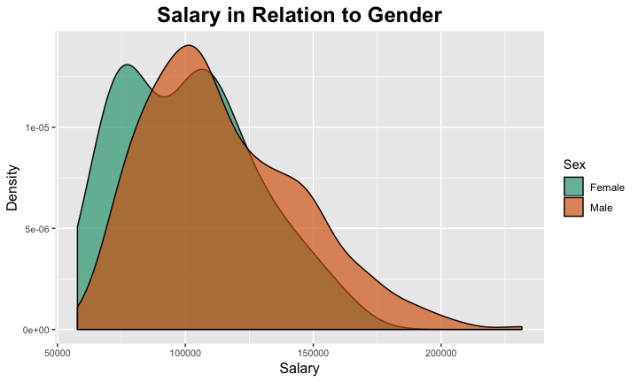
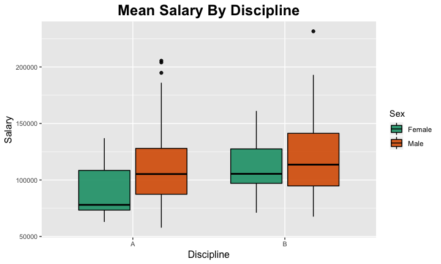
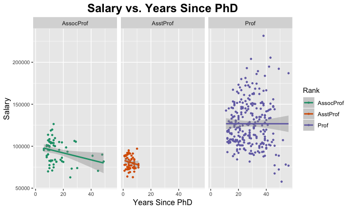
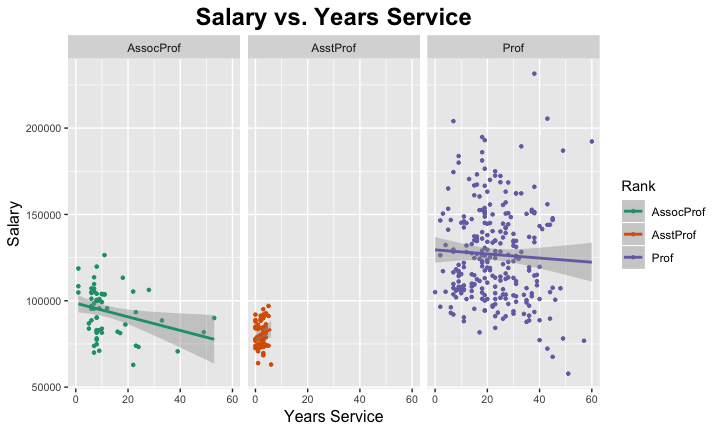

## INTRO
We are interested in how much money do professors make, and what affects the salary distribution.
Used data from: "https://vincentarelbundock.github.io/Rdatasets/datasets.html"

```
## Warning: Missing column names filled in: 'X1' [1]
```

```
## Parsed with column specification:
## cols(
##   X1 = col_double(),
##   rank = col_character(),
##   discipline = col_character(),
##   yrs.since.phd = col_double(),
##   yrs.service = col_double(),
##   sex = col_character(),
##   salary = col_double()
## )
```


##This dataset includes:

- Rank: Professor, Assistant Professor, and Associate Professor
- Discipline: A and B
- Years since Phd
- Years since Service
- Salary


#PACKAGES
We used the following libraries:


```
## ── Attaching packages ─────────────────────────────────────── tidyverse 1.2.1 ──
```

```
## ✔ ggplot2 3.1.0       ✔ purrr   0.3.1  
## ✔ tibble  2.0.1       ✔ dplyr   0.8.0.1
## ✔ tidyr   0.8.3       ✔ stringr 1.4.0  
## ✔ readr   1.3.1       ✔ forcats 0.4.0
```

```
## ── Conflicts ────────────────────────────────────────── tidyverse_conflicts() ──
## ✖ dplyr::filter() masks stats::filter()
## ✖ dplyr::lag()    masks stats::lag()
```


##HAVE A LOOK

```
## Skim summary statistics
##  n obs: 397 
##  n variables: 7 
## 
## ── Variable type:character ─────────────────────────────────────────────────────
##    variable missing complete   n min max empty n_unique
##  discipline       0      397 397   1   1     0        2
##        rank       0      397 397   4   9     0        3
##         sex       0      397 397   4   6     0        2
## 
## ── Variable type:numeric ───────────────────────────────────────────────────────
##       variable missing complete   n      mean       sd    p0   p25    p50
##         salary       0      397 397 113706.46 30289.04 57800 91000 107300
##             X1       0      397 397    199      114.75     1   100    199
##    yrs.service       0      397 397     17.61    13.01     0     7     16
##  yrs.since.phd       0      397 397     22.31    12.89     1    12     21
##     p75   p100     hist
##  134185 231545 ▃▇▇▅▃▂▁▁
##     298    397 ▇▇▇▇▇▇▇▇
##      27     60 ▇▆▅▅▂▂▁▁
##      32     56 ▆▇▇▇▆▅▂▁
```

##QUESTIONS?
1. Who makes the most money?
2. How does salary differ by ranks?
3. Does salary differ by gender?
4. What is discipline?
5. Does the amount of time you spent on the job affect your income?


##MAKE TIDY DATA

```
## # A tibble: 397 x 7
##    Participants Rank      Discipline Yrs_since_PhD Yrs_service Sex   Salary
##           <dbl> <chr>     <chr>              <dbl>       <dbl> <chr>  <dbl>
##  1            1 Prof      B                     19          18 Male  139750
##  2            2 Prof      B                     20          16 Male  173200
##  3            3 AsstProf  B                      4           3 Male   79750
##  4            4 Prof      B                     45          39 Male  115000
##  5            5 Prof      B                     40          41 Male  141500
##  6            6 AssocProf B                      6           6 Male   97000
##  7            7 Prof      B                     30          23 Male  175000
##  8            8 Prof      B                     45          45 Male  147765
##  9            9 Prof      B                     21          20 Male  119250
## 10           10 Prof      B                     18          18 Fema… 129000
## # … with 387 more rows
```

##OVERALL DISTRIBUTION

```
## `stat_bin()` using `bins = 30`. Pick better value with `binwidth`.
```

<!-- -->


##AVERAGE SALARY PER RANK

```
## # A tibble: 3 x 2
##   Rank      Mean_Salary
##   <chr>           <dbl>
## 1 AssocProf      93876.
## 2 AsstProf       80776.
## 3 Prof          126772.
```

##PUT THE NUMBERS IN A GRAPH
<!-- -->
  
##AVERAGE SALARY BY GENDER

```
## # A tibble: 2 x 2
##   Sex    Mean_Salary
##   <chr>        <dbl>
## 1 Female     101002.
## 2 Male       115090.
```

##PUT IT IN A GRAPH 
<!-- -->

##GENDER DISTRIBUTION 
<!-- -->


##DENSITY BY GENDER
<!-- -->


##DISCIPLINES
<!-- -->


##YEARS SINCE RECEIVING A PHD 
<!-- -->


##YEARS SINCE SERVICNG 
<!-- -->


##CONCLUSIONS

- There is a visible difference between salary of male professors and female professors. However, the distribution of female and male professors is more shocking.

- Assistant professors have the lowest average salary, while full professors have the highest average salary.

- The longer a professor has been a PhD and serving, the higher salary s/he gets.
