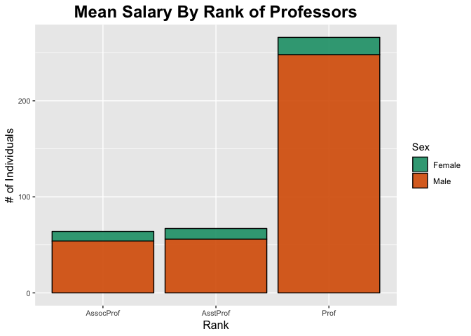
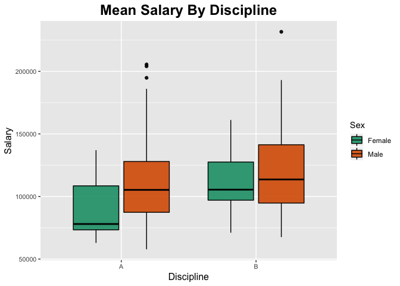
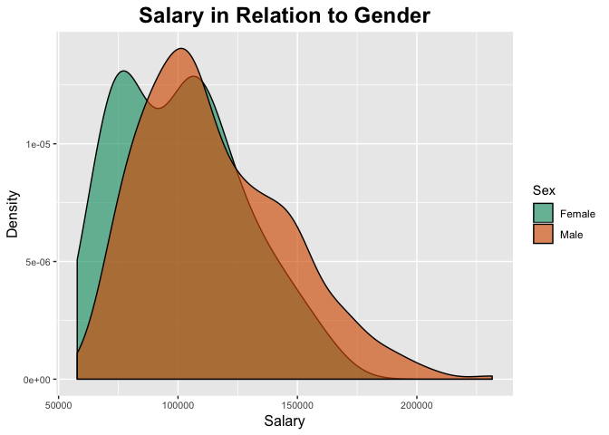
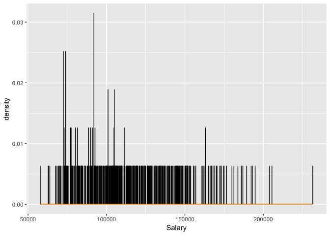
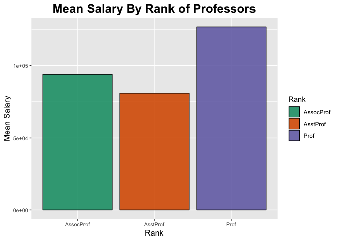
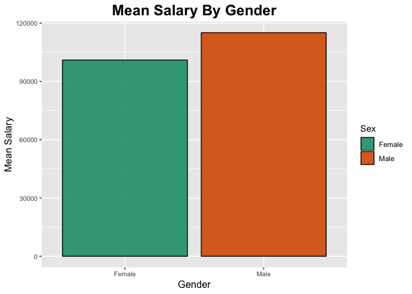
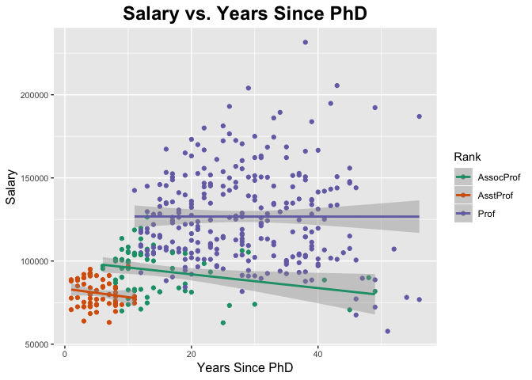
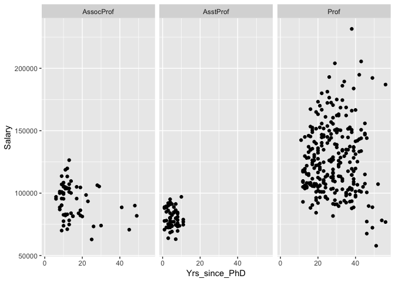
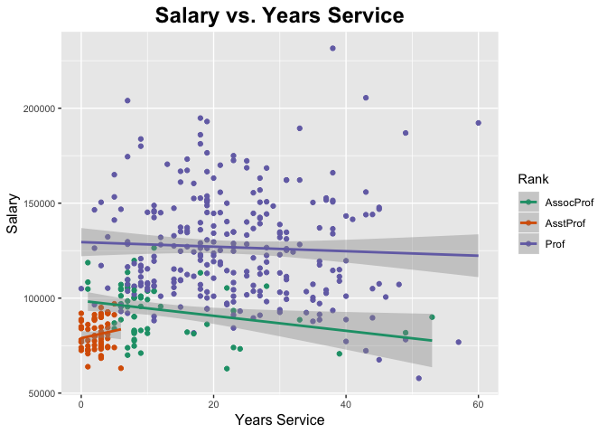

```r
library(tidyverse)
```

```
## ── Attaching packages ─────────────────────────────────────── tidyverse 1.2.1 ──
```

```
## ✔ ggplot2 3.1.0       ✔ purrr   0.3.0  
## ✔ tibble  2.0.1       ✔ dplyr   0.8.0.1
## ✔ tidyr   0.8.2       ✔ stringr 1.4.0  
## ✔ readr   1.3.1       ✔ forcats 0.3.0
```

```
## ── Conflicts ────────────────────────────────────────── tidyverse_conflicts() ──
## ✖ dplyr::filter() masks stats::filter()
## ✖ dplyr::lag()    masks stats::lag()
```

```r
library(dplyr)
library("RColorBrewer")
library("paletteer")
```


```r
prof_salary <-
  readr::read_csv("/users/kit/Desktop/How-Much-Money-Can-You-Make/salaries_prof.csv")
```

```
## Warning: Missing column names filled in: 'X1' [1]
```

```
## Parsed with column specification:
## cols(
##   X1 = col_double(),
##   rank = col_character(),
##   discipline = col_character(),
##   yrs.since.phd = col_double(),
##   yrs.service = col_double(),
##   sex = col_character(),
##   salary = col_double()
## )
```


```r
prof_salary
```

```
## # A tibble: 397 x 7
##       X1 rank      discipline yrs.since.phd yrs.service sex    salary
##    <dbl> <chr>     <chr>              <dbl>       <dbl> <chr>   <dbl>
##  1     1 Prof      B                     19          18 Male   139750
##  2     2 Prof      B                     20          16 Male   173200
##  3     3 AsstProf  B                      4           3 Male    79750
##  4     4 Prof      B                     45          39 Male   115000
##  5     5 Prof      B                     40          41 Male   141500
##  6     6 AssocProf B                      6           6 Male    97000
##  7     7 Prof      B                     30          23 Male   175000
##  8     8 Prof      B                     45          45 Male   147765
##  9     9 Prof      B                     21          20 Male   119250
## 10    10 Prof      B                     18          18 Female 129000
## # … with 387 more rows
```


```r
glimpse(prof_salary)
```

```
## Observations: 397
## Variables: 7
## $ X1            <dbl> 1, 2, 3, 4, 5, 6, 7, 8, 9, 10, 11, 12, 13, 14, 15,…
## $ rank          <chr> "Prof", "Prof", "AsstProf", "Prof", "Prof", "Assoc…
## $ discipline    <chr> "B", "B", "B", "B", "B", "B", "B", "B", "B", "B", …
## $ yrs.since.phd <dbl> 19, 20, 4, 45, 40, 6, 30, 45, 21, 18, 12, 7, 1, 2,…
## $ yrs.service   <dbl> 18, 16, 3, 39, 41, 6, 23, 45, 20, 18, 8, 2, 1, 0, …
## $ sex           <chr> "Male", "Male", "Male", "Male", "Male", "Male", "M…
## $ salary        <dbl> 139750, 173200, 79750, 115000, 141500, 97000, 1750…
```


```r
prof_salary %>% 
  skimr::skim()
```

```
## Skim summary statistics
##  n obs: 397 
##  n variables: 7 
## 
## ── Variable type:character ─────────────────────────────────────────────────────
##    variable missing complete   n min max empty n_unique
##  discipline       0      397 397   1   1     0        2
##        rank       0      397 397   4   9     0        3
##         sex       0      397 397   4   6     0        2
## 
## ── Variable type:numeric ───────────────────────────────────────────────────────
##       variable missing complete   n      mean       sd    p0   p25    p50
##         salary       0      397 397 113706.46 30289.04 57800 91000 107300
##             X1       0      397 397    199      114.75     1   100    199
##    yrs.service       0      397 397     17.61    13.01     0     7     16
##  yrs.since.phd       0      397 397     22.31    12.89     1    12     21
##     p75   p100     hist
##  134185 231545 ▃▇▇▅▃▂▁▁
##     298    397 ▇▇▇▇▇▇▇▇
##      27     60 ▇▆▅▅▂▂▁▁
##      32     56 ▆▇▇▇▆▅▂▁
```


```r
prof_salary_tidy <-prof_salary %>% 
  dplyr::rename(
    Participants = X1,
    Rank = rank,
    Discipline = discipline,
    Yrs_since_PhD = yrs.since.phd,
    Yrs_service = yrs.service,
    Sex = sex,
    Salary = salary)
prof_salary_tidy
```

```
## # A tibble: 397 x 7
##    Participants Rank      Discipline Yrs_since_PhD Yrs_service Sex   Salary
##           <dbl> <chr>     <chr>              <dbl>       <dbl> <chr>  <dbl>
##  1            1 Prof      B                     19          18 Male  139750
##  2            2 Prof      B                     20          16 Male  173200
##  3            3 AsstProf  B                      4           3 Male   79750
##  4            4 Prof      B                     45          39 Male  115000
##  5            5 Prof      B                     40          41 Male  141500
##  6            6 AssocProf B                      6           6 Male   97000
##  7            7 Prof      B                     30          23 Male  175000
##  8            8 Prof      B                     45          45 Male  147765
##  9            9 Prof      B                     21          20 Male  119250
## 10           10 Prof      B                     18          18 Fema… 129000
## # … with 387 more rows
```


```r
prof_salary_tidy
```

```
## # A tibble: 397 x 7
##    Participants Rank      Discipline Yrs_since_PhD Yrs_service Sex   Salary
##           <dbl> <chr>     <chr>              <dbl>       <dbl> <chr>  <dbl>
##  1            1 Prof      B                     19          18 Male  139750
##  2            2 Prof      B                     20          16 Male  173200
##  3            3 AsstProf  B                      4           3 Male   79750
##  4            4 Prof      B                     45          39 Male  115000
##  5            5 Prof      B                     40          41 Male  141500
##  6            6 AssocProf B                      6           6 Male   97000
##  7            7 Prof      B                     30          23 Male  175000
##  8            8 Prof      B                     45          45 Male  147765
##  9            9 Prof      B                     21          20 Male  119250
## 10           10 Prof      B                     18          18 Fema… 129000
## # … with 387 more rows
```


```r
Mean_Salary <- prof_salary_tidy %>% 
  group_by(Rank) %>% 
  summarize(Mean_Salary=(mean(Salary, na.rm = TRUE)))
Mean_Salary
```

```
## # A tibble: 3 x 2
##   Rank      Mean_Salary
##   <chr>           <dbl>
## 1 AssocProf      93876.
## 2 AsstProf       80776.
## 3 Prof          126772.
```


```r
prof_salary_tidy %>% 
  ggplot(aes(x=Rank, fill=Sex))+
  geom_bar(alpha=0.9, color="black")+
  labs(title = "Mean Salary By Rank of Professors",
       x = "Rank",
       y = "# of Individuals")+
  theme(plot.title=element_text(size=18, face="bold", hjust = 0.5),
        axis.text=element_text(size=8),
        axis.title=element_text(size=12))+
  scale_fill_brewer(palette = "Dark2")
```

<!-- -->


```r
prof_salary_tidy %>% 
  ggplot(aes(x=Discipline, y=Salary, fill=Sex))+
  geom_boxplot(alpha=0.9, color="black")+
  labs(title = "Mean Salary By Discipline",
       x = "Discipline",
       y = "Salary")+
  theme(plot.title=element_text(size=18, face="bold", hjust = 0.5),
        axis.text=element_text(size=8),
        axis.title=element_text(size=12))+
  scale_fill_brewer(palette = "Dark2")
```

<!-- -->


```r
prof_salary_tidy %>% 
  ggplot(aes(x=Salary, fill=Sex))+
  geom_density(alpha=0.65)+
  labs(title = "Salary in Relation to Gender",
       x = "Salary",
       y = "Density")+
  theme(plot.title=element_text(size=18, face="bold", hjust = 0.5),
        axis.text=element_text(size=8),
        axis.title=element_text(size=12))+
  scale_fill_brewer(palette = "Dark2")
```

<!-- -->

```r
prof_salary_tidy %>% 
  ggplot(aes(x=Salary))+
  geom_histogram(aes(y = ..density..), binwidth = .4, fill="darkgreen", alpha=0.8, color="black")+
  geom_density(color="orange")
```

<!-- -->


```r
Mean_Salary %>% 
  ggplot(aes(x=Rank, y=Mean_Salary,fill=Rank))+
  geom_bar(stat="identity", alpha=0.9, color="black")+
  labs(title = "Mean Salary By Rank of Professors",
       x = "Rank",
       y = "Mean Salary")+
  theme(plot.title=element_text(size=18, face="bold", hjust = 0.5),
        axis.text=element_text(size=8),
        axis.title=element_text(size=12))+
  scale_fill_brewer(palette = "Dark2")
```

<!-- -->


```r
Mean_Salary_Gender <- prof_salary_tidy %>% 
  group_by(Sex) %>% 
  summarize(Mean_Salary=(mean(Salary, na.rm = TRUE)))
Mean_Salary_Gender
```

```
## # A tibble: 2 x 2
##   Sex    Mean_Salary
##   <chr>        <dbl>
## 1 Female     101002.
## 2 Male       115090.
```


```r
Mean_Salary_Gender %>% 
  ggplot(aes(x=Sex, y=Mean_Salary,fill=Sex))+
  geom_bar(stat="identity", alpha=0.9, color="black")+
  labs(title = "Mean Salary By Gender",
       x = "Gender",
       y = "Mean Salary")+
  theme(plot.title=element_text(size=18, face="bold", hjust = 0.5),
        axis.text=element_text(size=8),
        axis.title=element_text(size=12))+
  scale_fill_brewer(palette = "Dark2")
```

<!-- -->


```r
prof_salary_tidy %>% 
  ggplot(aes(x=Yrs_since_PhD, y=Salary, color=Rank))+
  geom_point()+
  geom_smooth(method=lm, se=TRUE)+
  labs(title = "Salary vs. Years Since PhD",
       x = "Years Since PhD",
       y = "Salary")+
  theme(plot.title=element_text(size=18, face="bold", hjust = 0.5),
        axis.text=element_text(size=8),
        axis.title=element_text(size=12))+
  scale_colour_brewer(palette = "Dark2")
```

<!-- -->


```r
prof_salary_tidy %>% 
  ggplot(aes(x=Yrs_since_PhD, y=Salary))+
  geom_point()+
  facet_wrap(~Rank)
```

<!-- -->


```r
prof_salary_tidy %>% 
  ggplot(aes(x=Yrs_service, y=Salary, color=Rank))+
  geom_point()+
  geom_smooth(method=lm, se=TRUE)+
  labs(title = "Salary vs. Years Service",
       x = "Years Service",
       y = "Salary")+
  theme(plot.title=element_text(size=18, face="bold", hjust = 0.5),
        axis.text=element_text(size=8),
        axis.title=element_text(size=12))+
  scale_colour_brewer(palette = "Dark2")
```

<!-- -->


